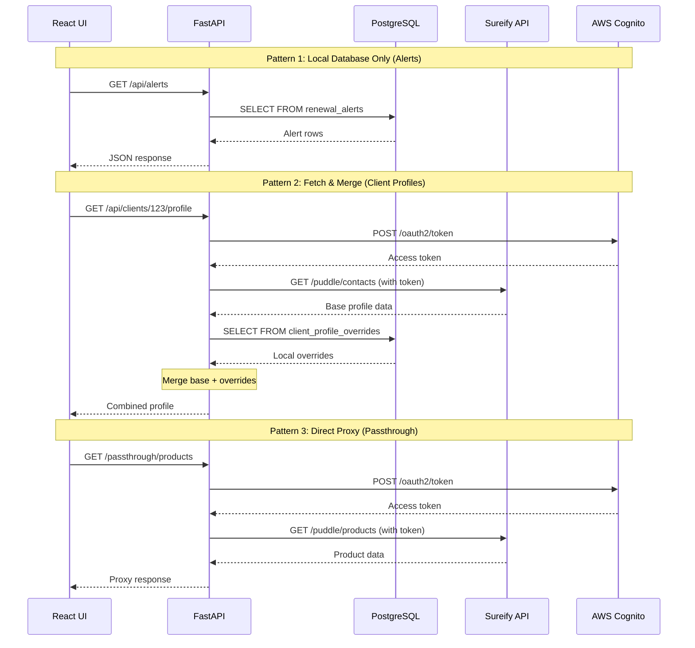
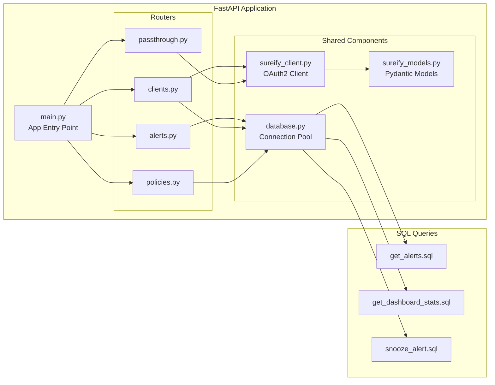
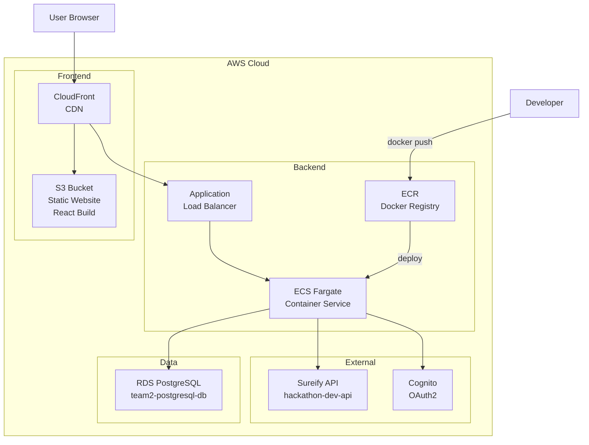
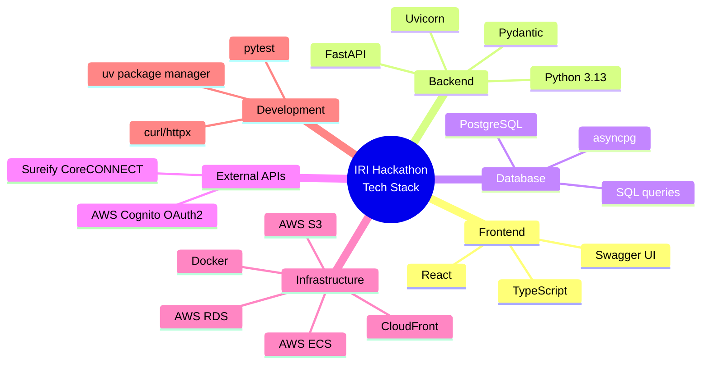

# Architecture Diagram

## System Architecture

```mermaid
graph TB
    subgraph "Frontend"
        UI[React UI<br/>S3 Static Site<br/>hackathon-team2-ui.s3...amazonaws.com]
    end

    subgraph "Backend - FastAPI Application (Port 8000)"
        API[FastAPI App<br/>api.main:app]

        subgraph "Routers"
            ALERTS[Alerts Router<br/>/api/alerts<br/>/api/dashboard/stats]
            CLIENTS[Clients Router<br/>/api/clients/{id}/profile]
            PRODUCTS[Products Router<br/>/passthrough/products]
            PASSTHROUGH[Passthrough Router<br/>/passthrough/*]
            POLICIES[Policies Router<br/>/v2/policies]
        end

        API --> ALERTS
        API --> CLIENTS
        API --> PRODUCTS
        API --> PASSTHROUGH
        API --> POLICIES
    end

    subgraph "Data Layer"
        DB[(PostgreSQL<br/>RDS)]
        SUREIFY[Sureify API<br/>hackathon-dev-api.sureify.com]
        COGNITO[AWS Cognito<br/>OAuth2 Token]
    end

    subgraph "Database Tables"
        T1[renewal_alerts]
        T2[client_profile_overrides]
        T3[contract_summary]
        T4[products]
    end

    %% User interactions
    UI -->|HTTP GET/POST| API

    %% Alerts flow
    ALERTS -->|Read/Write| T1
    ALERTS -->|Stats queries| DB

    %% Clients flow (Fetch & Merge)
    CLIENTS -->|1. Fetch base data| SUREIFY
    CLIENTS -->|2. Fetch overrides| T2
    CLIENTS -->|3. Merge & return| UI

    %% Products flow (Proxy)
    PRODUCTS -->|Proxy request| SUREIFY
    PASSTHROUGH -->|Direct proxy| SUREIFY

    %% Policies flow
    POLICIES -->|Query| T3

    %% Database connections
    DB --> T1
    DB --> T2
    DB --> T3
    DB --> T4

    %% Authentication
    PASSTHROUGH -->|1. Get token| COGNITO
    CLIENTS -->|1. Get token| COGNITO
    PRODUCTS -->|1. Get token| COGNITO
    COGNITO -->|2. Access token| SUREIFY

    %% Styling
    classDef frontend fill:#e1f5ff,stroke:#01579b,stroke-width:2px
    classDef backend fill:#fff3e0,stroke:#e65100,stroke-width:2px
    classDef data fill:#f3e5f5,stroke:#4a148c,stroke-width:2px
    classDef router fill:#fff9c4,stroke:#f57f17,stroke-width:1px

    class UI frontend
    class API,ALERTS,CLIENTS,PRODUCTS,PASSTHROUGH,POLICIES backend
    class DB,SUREIFY,COGNITO,T1,T2,T3,T4 data
    class ALERTS,CLIENTS,PRODUCTS,PASSTHROUGH,POLICIES router
```

## Data Flow Patterns



## Component Diagram



## Deployment Architecture



## Technology Stack



## View in GitHub

These diagrams use **Mermaid** syntax and will render automatically in:
- ✅ GitHub README.md
- ✅ VS Code (with Mermaid extension)
- ✅ GitLab
- ✅ Many markdown viewers

## Generate PNG/SVG

To convert to image files:

```bash
# Install mermaid CLI
npm install -g @mermaid-js/mermaid-cli

# Generate PNG
mmdc -i ARCHITECTURE_DIAGRAM.md -o architecture.png

# Generate SVG
mmdc -i ARCHITECTURE_DIAGRAM.md -o architecture.svg
```

Or use online tools:
- https://mermaid.live/
- Copy/paste the diagram code
- Export as PNG/SVG/PDF
