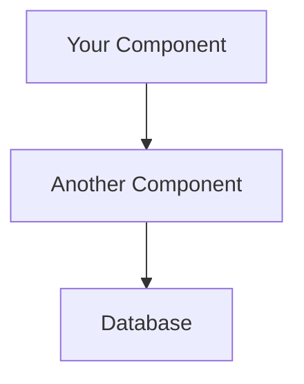

# Architecture Diagram Guide

Your project now has **3 ways** to view/generate architecture diagrams:

## 🎯 Quick Start (No Installation)

### Option 1: View Mermaid Diagrams (Instant)

Open [ARCHITECTURE_DIAGRAM.md](ARCHITECTURE_DIAGRAM.md) in:
- ✅ **GitHub** - Renders automatically
- ✅ **VS Code** - Install "Markdown Preview Mermaid Support" extension
- ✅ **GitLab** - Renders automatically

**Or use online:**
1. Go to https://mermaid.live/
2. Copy diagram code from [ARCHITECTURE_DIAGRAM.md](ARCHITECTURE_DIAGRAM.md)
3. Paste and view instantly
4. Export as PNG/SVG/PDF

**Diagrams included:**
- System Architecture (full stack)
- Data Flow Patterns (3 patterns)
- Component Diagram (routers & modules)
- Deployment Architecture (AWS)
- Technology Stack (mindmap)

---

## 🐍 Option 2: Generate PNG/SVG with Python

### Prerequisites

1. **Install Python library:**
```bash
pip install diagrams
```

2. **Install Graphviz (system-level):**

**Windows:**
```bash
# Using Chocolatey
choco install graphviz

# OR download installer from:
# https://graphviz.org/download/
```

**Mac:**
```bash
brew install graphviz
```

**Linux:**
```bash
sudo apt-get install graphviz
```

3. **Verify installation:**
```bash
dot -V
# Should output: dot - graphviz version X.X.X
```

### Generate Diagrams

```bash
# Simple version (recommended)
python scripts/generate_simple_diagram.py

# Output files:
#   diagrams/main_architecture.png
#   diagrams/data_patterns.png
#   diagrams/database_schema.png
#   diagrams/deployment_arch.png
```

**Generated diagrams:**
- Main Architecture - Shows UI → API → Database → Sureify
- Data Access Patterns - Shows 3 patterns (Local DB, Fetch & Merge, Cached)
- Database Schema - Shows table relationships
- Deployment Architecture - Shows AWS resources

### View Generated Diagrams

```bash
# Windows
start diagrams/main_architecture.png

# Mac
open diagrams/main_architecture.png

# Linux
xdg-open diagrams/main_architecture.png
```

---

## 🌐 Option 3: Online Diagram Tools

### Mermaid Live Editor
**Best for: Quick sharing and exports**

1. Go to https://mermaid.live/
2. Copy diagram from [ARCHITECTURE_DIAGRAM.md](ARCHITECTURE_DIAGRAM.md)
3. Paste into editor
4. Click "Actions" → Export PNG/SVG/PDF

### Draw.io / diagrams.net
**Best for: Custom diagrams**

1. Go to https://app.diagrams.net/
2. Use templates or create from scratch
3. Save to Google Drive / local file

### Lucidchart
**Best for: Professional presentations**

1. Go to https://www.lucidchart.com/
2. Use AWS architecture templates
3. Export as PNG/PDF

---

## 📊 What Each Diagram Shows

### System Architecture
```
User → React UI (S3) → FastAPI → PostgreSQL
                    ↘ → Sureify API
```
**Shows:** High-level system components and connections

### Data Flow Patterns
```
Pattern 1: UI → API → PostgreSQL (alerts)
Pattern 2: UI → API → Sureify + PostgreSQL → Merge (clients)
Pattern 3: UI → API → Cache → Sureify (products)
```
**Shows:** How different endpoints handle data

### Component Structure
```
main.py → routers (alerts, clients, products)
       → shared (database, sureify_client)
```
**Shows:** Code organization and dependencies

### Deployment Architecture
```
Developer → Docker → ECR → ECS Fargate
                          ↓
                     RDS PostgreSQL
                          ↓
                     Sureify API
```
**Shows:** AWS infrastructure and deployment flow

---

## 🎨 Customizing Diagrams

### Modify Mermaid Diagrams

Edit [ARCHITECTURE_DIAGRAM.md](ARCHITECTURE_DIAGRAM.md):



**Styling:**
- `TB` = Top to Bottom
- `LR` = Left to Right
- `-->` = Arrow
- `-.->` = Dotted line
- `==>` = Thick arrow

### Modify Python Diagrams

Edit `scripts/generate_simple_diagram.py`:

```python
# Add a new component
new_service = Python("New Service")

# Add connection
api >> Edge(label="calls") >> new_service
```

**Available icons:**
- `Python()` - Python service
- `RDS()` - Database
- `S3()` - Storage
- `ECS()` - Container
- `ALB()` - Load balancer

---

## 🔧 Troubleshooting

### "Graphviz not found"

**Problem:** Python can find `diagrams` but not Graphviz

**Solution:**
1. Install Graphviz (see prerequisites above)
2. **Restart your terminal** (important!)
3. Verify: `dot -V`

### "ModuleNotFoundError: No module named 'diagrams'"

**Solution:**
```bash
pip install diagrams
```

### Diagrams look blurry

**Solution:**
```python
# Increase DPI in script
with Diagram(..., graph_attr={"dpi": "300"}):
```

### Need different format

**Solution:**
```python
# Change outformat
with Diagram(..., outformat="svg"):  # or "pdf"
```

---

## 📁 Output Structure

After running the Python script:

```
c:\Hackathon\code\
├── diagrams/                    # ← Generated files
│   ├── main_architecture.png
│   ├── data_patterns.png
│   ├── database_schema.png
│   └── deployment_arch.png
├── scripts/
│   └── generate_simple_diagram.py
└── ARCHITECTURE_DIAGRAM.md      # ← Mermaid source
```

---

## 🚀 Recommended Workflow

### For Presentations
1. Generate PNG with Python script
2. Insert into PowerPoint/Google Slides
3. Add annotations and notes

### For Documentation
1. Use Mermaid diagrams in `ARCHITECTURE_DIAGRAM.md`
2. Automatically renders in GitHub/GitLab
3. Always up-to-date with code

### For Sharing
1. Export from mermaid.live as SVG
2. Share high-quality vector image
3. Scalable without quality loss

---

## 💡 Tips

1. **Keep diagrams simple** - Show high-level concepts, not every detail
2. **Update regularly** - When architecture changes, update diagrams
3. **Use consistent colors** - Same color for same component type
4. **Add legends** - Explain what different shapes/colors mean
5. **Version control** - Commit diagram source code, not just images

---

## 🎓 Learning Resources

**Mermaid:**
- Documentation: https://mermaid.js.org/
- Live editor: https://mermaid.live/
- Examples: https://github.com/mermaid-js/mermaid/tree/develop/demos

**Diagrams (Python):**
- Documentation: https://diagrams.mingrammer.com/
- Examples: https://diagrams.mingrammer.com/docs/getting-started/examples

**Architecture Patterns:**
- AWS Architecture: https://aws.amazon.com/architecture/
- C4 Model: https://c4model.com/

---

## 📝 Summary

| Method | Speed | Quality | Customization | Use Case |
|--------|-------|---------|---------------|----------|
| **Mermaid** | ⚡⚡⚡ | ⭐⭐⭐ | ⭐⭐ | GitHub docs, quick sharing |
| **Python** | ⚡⚡ | ⭐⭐⭐⭐ | ⭐⭐⭐⭐ | Presentations, reports |
| **Online Tools** | ⚡⚡⚡ | ⭐⭐⭐⭐⭐ | ⭐⭐⭐⭐⭐ | Professional docs |

**Recommendation:** Start with Mermaid for quick iteration, then generate PNG with Python for presentations.
