# AgentTwo Flow

AgentTwo reads the database and Sureify for current state, accepts JSON changes (suitability, client goals, client profile) from the front-end, and generates product recommendations. Optional IRI API integration for comparison when `alert_id` and `IRI_API_BASE_URL` are set.

```mermaid
flowchart TB
    subgraph entry["Entry"]
        CLI["CLI / LLM invocation"]
        tool_only["--tool-only?"]
        CLI --> tool_only
    end

    subgraph tool_only_flow["Tool-only path"]
        T1["get_current_database_context(client_id)"]
        T2["generate_product_recommendations(changes_json, client_id, alert_id)"]
        tool_only -->|yes| T1
        T1 --> T2
    end

    subgraph llm_flow["LLM path"]
        agent["Strands Agent"]
        msg["User message"]
        tool_only -->|no| agent
        msg --> agent
        agent --> T1
        agent --> T2
    end

    subgraph get_context["get_current_database_context"]
        db["fetch_db_context(client_id)"]
        db_tables["DB: clients, client_suitability_profiles,\ncontract_summary, products"]
        sureify["_get_sureify_context(customer_id)"]
        sureify_calls["Sureify Puddle: policyData, productOption,\nsuitabilityData, clientProfile; notes if available"]
        merge_ctx["Merge → return JSON context"]
        db --> db_tables
        sureify --> sureify_calls
        db_tables --> merge_ctx
        sureify_calls --> merge_ctx
    end

    subgraph gen_recs["generate_product_recommendations"]
        parse["Parse changes_json"]
        validate["Validate → ProfileChangesInput\n(suitability, clientGoals, clientProfile)"]
        emit_fail["Emit failure event"]
        parse --> validate
        validate -->|invalid| emit_fail

        load_ctx["Load db_context\n(fetch_db_context + _get_sureify_context)"]
        validate -->|valid| load_ctx

        upsert["If client_profile or suitability:\nbuild_profile_row_from_changes\n→ upsert_client_suitability_profile"]
        load_ctx --> upsert

        iri_guard["alert_id and IRI_API_BASE_URL?"]
        upsert --> iri_guard
        iri_guard -->|yes| iri_save["save_iri_client_profile\nsave_iri_suitability\nrun_iri_comparison(alert_id)"]
        iri_guard -->|no| gen["generate_recommendations(...)"]
        iri_save --> gen

        subgraph generate_recommendations["generate_recommendations (recommendations.py)"]
            resolve_client["Resolve client row from clients"]
            merged_suit["_merge_suitability(DB profile + changes.suitability)"]
            merged_goals["_merge_goals_and_profile(DB + changes.clientGoals, clientProfile)"]
            catalog["Prefer Sureify products else DB products"]
            build_recs["Build ProductRecommendation list\n(contextualized match_reason)"]
            sort_cap["Sort by rate, cap at max_recommendations"]
            explain["_build_choice_explanation\n_build_reasons_to_switch"]
            out_rec["ProductRecommendationsOutput"]
            resolve_client --> merged_suit
            merged_suit --> merged_goals
            merged_goals --> catalog
            catalog --> build_recs
            build_recs --> sort_cap
            sort_cap --> explain
            explain --> out_rec
        end

        gen --> generate_recommendations

        eapply["Build ElectronicApplicationPayload\n(merged_profile + selected products)"]
        storable["Build AgentTwoStorablePayload"]
        persist["persist_agent_two_payload → DB"]
        emit_ok["Emit success event (persist_event)"]
        eapply --> storable
        out_rec --> eapply
        storable --> persist
        persist --> emit_ok
        emit_ok --> return_json["Return ProductRecommendationsOutput JSON"]
    end

    T1 --> get_context
    T2 --> gen_recs
```

## Data flow summary

| Step | Input | Output |
|------|--------|--------|
| **get_current_database_context** | `client_id` | JSON: `clients`, `client_suitability_profiles`, `contract_summary`, `products`, `sureify_policies`, `sureify_notifications_by_policy`, `sureify_products`, `sureify_suitability_data`, `sureify_client_profiles` |
| **generate_product_recommendations** | `changes_json`, `client_id`, `alert_id?` | JSON: `ProductRecommendationsOutput` (recommendations, explanation, reasons_to_switch, merged_profile_summary, storable_payload, iri_comparison_result when applicable) |

## Endpoints used by AgentTwo

AgentTwo does not expose HTTP endpoints; it **calls** these when running its tools. All use the **Puddle Data API** schema (OpenAPI 3.0.3) with `persona=agent` and `UserID` header.

### Sureify (Puddle Data API)

| Purpose | Method | Endpoint | Response key |
|--------|--------|----------|--------------|
| Book of business (policies) | GET | `/puddle/policyData` | `policyData` |
| Product options (recommendations) | GET | `/puddle/productOption` | `productOptions` |
| Suitability assessments | GET | `/puddle/suitabilityData` | `suitabilityData` |
| Client profiles (parameters + suitability) | GET | `/puddle/clientProfile` | `clientProfiles` |
| Notifications (if available) | GET | `/puddle/notes` | — |

Base URL from `SUREIFY_BASE_URL`. When not set, agents use mock data (no HTTP calls). The spec also defines `/puddle/disclosureItem` and `/puddle/visualizationProduct`; agentTwo does not use them by default.

### IRI API (optional)

Used only when `alert_id` is provided and `IRI_API_BASE_URL` is set (inside `generate_product_recommendations`):

| Purpose | Method | Endpoint |
|--------|--------|----------|
| Save client profile for comparison | PUT | `/clients/{clientId}/profile` |
| Save suitability for alert | PUT | `/alerts/{alertId}/suitability` |
| Run comparison | POST | `/alerts/{alertId}/compare` |

Base URL from `IRI_API_BASE_URL`.

### Database (not HTTP)

Direct PostgreSQL via `DATABASE_URL` or `RDS*` env vars:

- **Read**: `clients`, `client_suitability_profiles`, `contract_summary`, `products` (via `db_reader`)
- **Write**: `client_suitability_profiles` (upsert), `agent_run_events`, `agent_two_recommendation_runs` (via `audit_writer`)

---

## Dependencies

- **db_reader**: `get_current_database_context` → clients, suitability profiles, contract_summary, products
- **sureify_client**: Puddle Data API — policyData, productOption, suitabilityData, clientProfile; notifications (or mock)
- **audit_writer**: `persist_event`, `persist_agent_two_payload`, `upsert_client_suitability_profile`, `build_profile_row_from_changes`
- **recommendations**: `generate_recommendations` (merge logic, product list, explanation, reasons to switch)
- **iri_client** (optional): `save_iri_client_profile`, `save_iri_suitability`, `run_iri_comparison`
